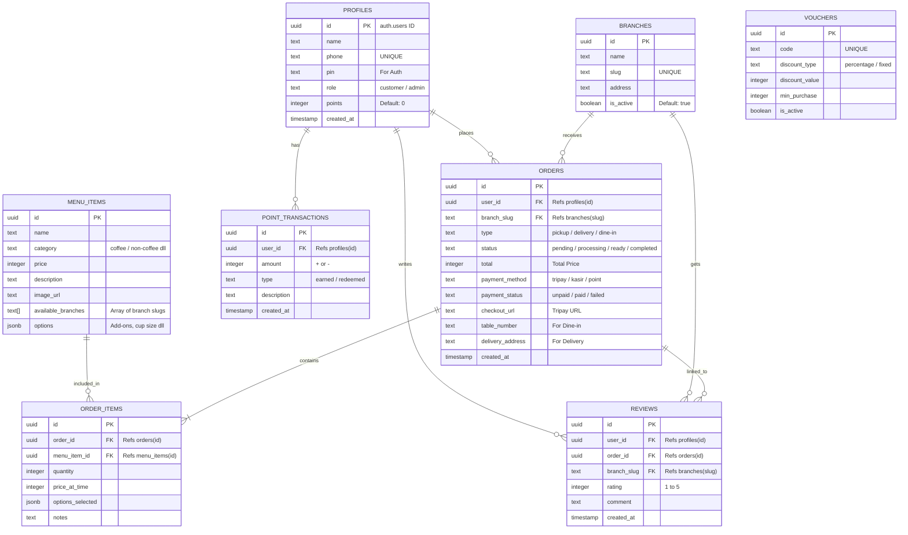

# Entity Relationship Diagram (ERD) LNR Coffee

Berikut adalah representasi visual ERD dari arsitektur database Supabase LNR Coffee, direpresentasikan dalam format **Mermaid.js** agar dapat dirender secara visual pada penampil Markdown yang mendukung (seperti GitHub).

## Diagram Skema (Mermaid)

## Rincian Relasi & Penjelasan

1. **PROFILES (One-to-Many) ke ORDERS, REVIEWS, POINT_TRANSACTIONS**
   - Setiap pengguna (`profiles`) bisa memiliki banyak pesanan (`orders`), menulis banyak ulasan (`reviews`), dan memiliki banyak riwayat poin (`point_transactions`).
   - `id` di `profiles` berelasi langsung dengan tabel bawaan `auth.users` di Supabase.

2. **BRANCHES (One-to-Many) ke ORDERS & REVIEWS**
   - Satu cabang / outlet (`branches`) dapat menerima banyak pesanan dan mendapatkan banyak ulasan. Relasi dikaitkan menggunakan kolom `slug` agar URL mudah dibaca.

3. **ORDERS (One-to-Many) ke ORDER_ITEMS**
   - Satu pesanan (`orders`) harus memiliki satu atau lebih rincian barang/minuman (`order_items`).
   - Apabila baris di tabel `orders` dihapus, seluruh baris `order_items` miliknya juga akan terhapus (*CASCADE DELETE*).

4. **ORDERS (One-to-One / One-to-Many) ke REVIEWS**
   - Satu pesanan dapat diberikan satu ulasan oleh pelanggan setelah status pesanan berubah menjadi `completed`.

5. **MENU_ITEMS (One-to-Many) ke ORDER_ITEMS**
   - Setiap minuman / menu (`menu_items`) dapat dibeli berkali-kali di berbagai transaksi pesanan (`order_items`).
   - Harga saat dibeli (`price_at_time`) disimpan terpisah di `order_items` untuk mencegah perubahan riwayat harga jika harga asli di `menu_items` diubah oleh admin.

6. **VOUCHERS (Independen)**
   - Vouchers berdiri sendiri dan divalidasi pada saat proses checkout menggunakan kolom unik `code`.
