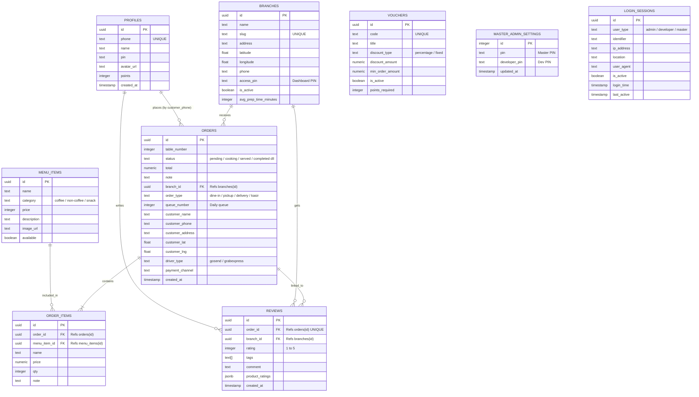

# Entity Relationship Diagram (ERD) LNR Coffee

Berikut adalah representasi visual ERD dari arsitektur database Supabase LNR Coffee, yang telah diperbarui dengan fitur-fitur terbaru (Aktivitas Login, Keamanan PIN, dan Dashboard Terpisah).

## Diagram Skema (Mermaid)

## Rincian Perubahan & Penjelasan Relasi

1. **BRANCHES**
   - Kolom `latitude` dan `longitude` digunakan untuk deteksi outlet terdekat secara otomatis.
   - Kolom `access_pin` memisahkan akses PIN per outlet (Bukan lagi satu PIN Master untuk semua outlet).

2. **ORDERS**
   - Kolom `order_type` sekarang mendukung `'kasir'` selain mode pelanggan (dine-in, pickup, delivery).
   - Penambahan `queue_number` untuk mengatur antrean cetak struk (reset setiap hari).
   - Detail pembeli langsung disimpan di orders (`customer_name`, `customer_phone`, dll) tanpa harus memaksa Foreign Key ke tabel profiles, memudahkan pesanan *Guest* / kasir offline.

3. **ORDER_ITEMS & MENU_ITEMS**
   - Rincian pesanan langsung menempel di `orders` dan mereferensikan `menu_items` jika ID-nya masih ada.

4. **MASTER_ADMIN_SETTINGS**
   - Memisahkan otentikasi `pin` (Pemilik) dengan `developer_pin` (IT / Pengembang) agar akses sistem sangat aman.

5. **LOGIN_SESSIONS**
   - Tabel independen untuk melacak siapa saja yang sedang mengakses dashboard (Outlet, Master, atau Dev).
   - Kolom `is_active` digunakan untuk melakukan fitur **Force Logout** dari jarak jauh (ditangani oleh realtime listener).

6. **CATATAN SISTEM AI ASISTEN**
   - **LNR Asisten AI** tidak memiliki tabel khusus di Supabase. Sistem AI bersifat *stateless* (tidak menyimpan data percakapan di database). Percakapan berjalan murni di sisi memori lokal pengguna (browser RAM) untuk menjaga privasi pengguna serta menghemat beban pembacaan/penulisan *(read/write)* server secara drastis. State nama pengguna yang digunakan oleh AI diambil secara langsung melalui sesi *Login* yang aktif pada browser.
